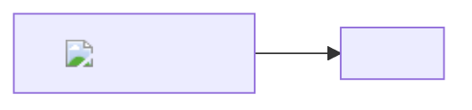

# MDWriter 安全测试

这份文档用于验证预览的 HTML 清洗、mermaid 安全级别与 CSP。正常表现：所有脚本类载荷全部静默失效，正常 Markdown 不受影响。

## 1. script 标签

## 2. img onerror

## 3. svg onload

<svg onload="alert('svg-onload')"></svg>

## 4. 事件属性

点我试试（不应有弹窗）

<h1 onmouseover="alert('hover-event')">悬停我（不应有弹窗）</h1>

## 5. javascript 链接

[点我执行 js](javascript:alert('js-link'))

## 6. iframe / object / embed

<iframe src="https://example.com"></iframe>

<object data="https://example.com"></object>

<embed src="https://example.com">

## 7. style / base / meta / link

<base href="https://evil.example">

<meta http-equiv="refresh" content="0;url=https://example.com">

<link rel="stylesheet" href="https://example.com/evil.css">

## 8. 表单控件

<form action="https://example.com"><input name="x"><button>提交</button></form>

## 9. mermaid 恶意标签

## 10. 正常内容应不受影响

**加粗**、*斜体*、`行内代码`、[正常链接](https://example.com)、表格。

| 列1 | 列2 |
| --- | --- |
| a | b |

> 引用块
